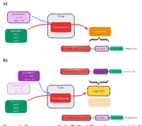

.. _getting_started:

Concepts
==========

File Identity
--------------

In file-centric pipelines, identity serves as the anchor and is indispensable 
in cloud-native systems. To make it simple and portable, we introduce the 
:class:`urgap.UFile` and its associated urgap canonical file signature (`ucfs`), 
inspired by ISBNs for books. Just as the same title can live in many bookstores 
yet keep one identifier, `ucfs` lets identical data objects exist across storage 
backends and clouds while preserving identity. A ucfs combines the object name 
and a content hash, e.g. ``<object_name>@<md5>``.

:class:`urgap.UFile` uses standard URIs and assigns the object name 
to the fragment: ``<schema>://<location>#<object_name>``

The checksum is provided as a URI query parameter or as metadata tags. 
The hash algorithms are pluggable, e.g., MD5 or blake2. By separating where 
an object lives from what it is, urgap makes file identity location-agnostic, 
enabling seamless retrieval and equality checks across clouds, simplifies 
migration, and lays the groundwork for a data cataloging, file mesh and 
discovery layer that exceeds traditional storage boundaries.

Provenance as Code (PaC)
--------------

Provenance, lineage, and reproducibility sit at the core of modern workflows.
We adopt Provenance as Code (PaC), a paradigm where lineage is embedded directly
in the processing architecture rather than bolted on afterward.

Unlike traditional systems that record provenance through separate system stores, PaC encodes
key lineage into the output filename. In urgap, users and pipelines do not choose
output names. Each name is a deterministic digest of the processing parameters
that affect results, the algorithm and its version, and the input file signatures
(the list of `ucfs`, see below and :numref:`Figure 1`). The result is an immutable PaC hash
that supports global smart rerun and reproducibility. Files in different locations
are treated as the same asset if their `ucfs` match, enabling identity-based reuse
across environments. This design plays well with explicit pipeline specs,
reproducible forks, and a data-mesh style where files are referenced by signature
and resolved to physical locations through a decentralized, optionally customizable
resolver.

   **Figure 1: Provenance as Code (PaC).**
   **a)** Three elements feed the PaC hash for an output: i) the input files' urgap canonical file signatures (ucfs, green), ii) the resource identifier (red), and iii) only those parameters that affect results (e.g., not thread counts, purple). 
   **b)** Changing a result-affecting parameter yields a different parameter digest and thus a different PaC hash.

Forking from an existing pipeline or defining one without knowing what outputs
already exist, urgap will skip steps whose outputs are already present. The encoded
provenance inherently supports the FAIR principles (Findable, Accessible,
Interoperable, Reusable), as every asset carries its own lineage, making it
self-describing and easier to govern without extra workload. Additionally, urgap
tracks the lineage tree in ufile tags.

Since the PaC hash cannot directly be mapped back to execution details,
additional run metadata has to be recorded elsewhere if required. Such a metadata
storage capability is also implemented in urgap as `urgap.umeta` and is populated
automatically during and after execution, tracking e.g. execution times and
user-defined metrics. For end-to-end visibility, urgap also exports traces using
the OpenTelemetry standard.

